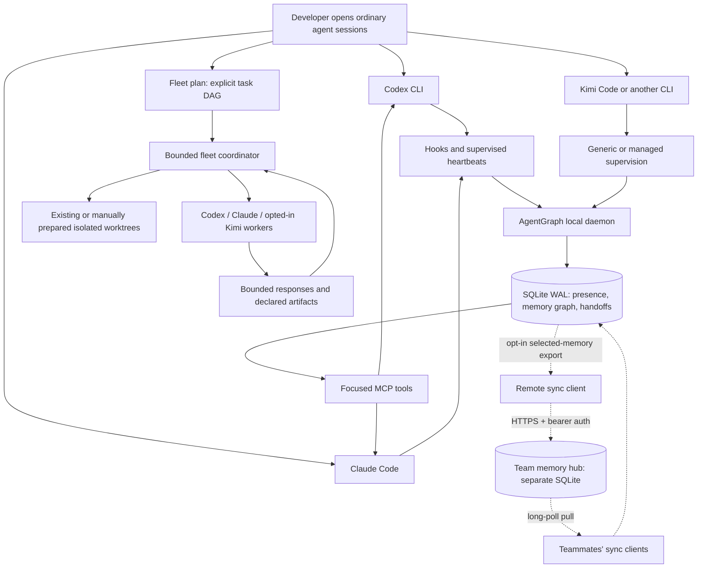

# AgentGraph

> **Stop being the message bus between your AI coding agents.**

If you run Codex, Claude, Kimi, or other coding agents, you already know the failure mode: one session discovers a constraint, another rediscovers it; two agents edit the same checkout; useful decisions disappear inside old context windows; and you copy plans, errors, and terminal output between tabs. AgentGraph is a local coordination layer for those problems: live presence, scoped memory, durable handoffs, and bounded multi-provider fleets.

This is useful when you want agents to share *selected work context* while you keep control of terminals, permissions, sandboxes, repositories, and network access. It does not copy hidden reasoning, inject keystrokes, silently merge transcripts, or bypass provider approval policies.

## What you can do

- See which agent sessions and processes are active in a repository.
- Save decisions, constraints, facts, procedures, and open questions once and retrieve them from another session.
- Send a bounded, auditable handoff with evidence and artifacts to an ordinary session's durable inbox.
- Run a task DAG containing Codex, Claude, and explicitly opted-in Kimi workers with concurrency, timeout, output, artifact, fail-fast, and worktree ownership bounds.
- Optionally sync selected non-secret memory through an authenticated team hub with long-poll near-real-time delivery.

## How it works



The normal path is local: one daemon is the only SQLite writer and provider MCP processes talk to it over an owner-only Unix socket. The remote branch is opt-in; the hub stores only records clients deliberately synchronize, never executes agents, and does not replace local memory.

## Provider support

| Provider or client | What works today |
| --- | --- |
| Codex CLI | First-class hooks, MCP setup, ordinary supervision, presence, memory, handoffs, managed delegation, and fleet tasks |
| Claude Code | First-class hooks, MCP setup, ordinary supervision, presence, memory, handoffs, managed delegation, and fleet tasks |
| Kimi Code CLI | Managed delegation and fleet tasks through documented `--prompt --output-format stream-json`; explicit automatic-permission acknowledgement required; no native AgentGraph hooks/MCP setup yet |
| Any local CLI | Presence and lifecycle supervision with `agentgraph run --provider <name> -- <command>` |
| Manually configured MCP client | Shared MCP tools, but no automatic provider hooks or identity correlation |

Kimi's documented non-interactive prompt mode uses its automatic permission policy. AgentGraph requires `--allow-provider-auto` (or the equivalent fleet field), never adds `--yolo`/`--auto`, and does not pretend Kimi exposes hard turn or USD caps. See the [official Kimi command reference](https://moonshotai.github.io/kimi-code/en/reference/kimi-command.html).

## Fleets and delegation are main features

Delegation launches one bounded provider task. Fleets launch an explicit dependency graph of bounded tasks, so a human can review *who will run, where, with which provider, and under which limits* before execution. A worker is told not to spawn another worker or fleet; nested managed fleets are blocked by inherited coordination state.

Create `fleet.json`:

```json
{
  "version": 1,
  "name": "auth-review",
  "root": {
    "cwd": ".",
    "maxConcurrency": 2,
    "timeoutMs": 1800000,
    "failFast": true
  },
  "tasks": [
    {
      "id": "codex-audit",
      "provider": "codex",
      "mode": "read-only",
      "worktree": "auto",
      "allowUnenforcedReadOnly": true,
      "objective": "Audit the authentication flow and report concrete risks."
    },
    {
      "id": "claude-tests",
      "provider": "claude",
      "mode": "read-only",
      "worktree": "auto",
      "allowUnenforcedReadOnly": true,
      "objective": "Review test coverage and propose focused regression tests."
    },
    {
      "id": "claude-fix",
      "provider": "claude",
      "mode": "writer",
      "worktree": "auto",
      "dependsOn": ["codex-audit", "claude-tests"],
      "objective": "Implement only the agreed fixes and add the regression tests."
    }
  ]
}
```

Review the graph and any required worktree preparation commands:

```sh
agentgraph fleet validate fleet.json
```

After you have created and inspected the printed linked worktrees, execute explicitly:

```sh
agentgraph fleet run fleet.json
```

`fleet run` uses existing worktrees; it does not silently create, merge, push, or delete them. Writers sharing an ownership key must be dependency-ordered and acquire an exclusive lease. Read-only is a worker policy and an isolated-worktree convention, not an operating-system sandbox; retain each provider's native sandbox and approvals. Codex/Kimi hard turn or USD limits are rejected because their current CLI adapters cannot guarantee them. A worker's dependency results and artifacts are marked as untrusted peer data in its prompt.

For one task instead of a graph:

```sh
agentgraph delegate --provider claude --max-turns 5 \
  --prompt "Review the authentication diff and return only blocking findings"

agentgraph delegate --provider kimi --allow-provider-auto \
  --prompt "Inspect this isolated worktree and summarize the failing tests"
```

Codex, Claude, and an ordinary human-controlled root CLI can invoke these commands. A managed worker cannot recursively create another managed fleet through normal AgentGraph state; the same-user local trust model still applies to malicious processes that deliberately erase their environment.

## Install from this checkout

### Easiest local install

From this checkout, run the user-local installer. It avoids `sudo`, global npm permissions, and aliases:

```sh
./scripts/install-local.sh
export PATH="$HOME/.local/bin:$PATH"
agentgraph setup
agentgraph daemon start
agentgraph doctor
```

Then start the local daemon and verify the graph:

```sh
agentgraph daemon start
agentgraph doctor
agentgraph ps
```

Then open normal `codex` and `claude` sessions. The first `ps` may take a few seconds while SQLite presence data is reconciled.

### Developer install

This folder is currently a source checkout, not a published npm package. It is Apache-2.0 licensed, but it has not been pushed to a public Git host or published to npm yet. Until a public URL is chosen, install it locally:

```sh
cd agentgraph
npm install
npm run check
npm link
agentgraph setup --dry-run
agentgraph setup
agentgraph doctor
```

Requirements: Node.js 20.19+ (Node 22 recommended), macOS for the current launchd installer, and any provider CLIs you plan to use already installed and authenticated. `npm link` is a source/developer install. Setup writes only AgentGraph-owned hook, MCP, skill, daemon, and optional shim entries; it backs up and merges existing configuration. Run the dry run first, and uninstall integrations before moving this folder.

## Ordinary Codex and Claude sessions

You do not have to replace normal sessions or copy transcripts.

| Mode | How to start | What AgentGraph knows |
| --- | --- | --- |
| Hook-discovered | Type plain `codex` or `claude` after setup | Presence plus supported provider session/turn events when correlation is unambiguous |
| Supervised | `agentgraph codex` or `agentgraph claude` | Strong process lease, lifecycle, session correlation, and MCP identity |
| Attach existing | `agentgraph attach --pid <pid>` | Presence first; native conversation ID after a supported hook/resume event |

Transparent shims are optional:

```sh
agentgraph setup --transparent
```

Follow the printed PATH instruction, then keep typing `codex` and `claude`. AgentGraph never types into an existing TUI. Ordinary sessions receive durable next-turn inbox messages; ask the recipient to check AgentGraph or let the coordination skill call `handoff_inbox` on a relevant turn.

## Local memory and handoffs

```sh
agentgraph memory put --type decision --scope "$(pwd)" \
  "Keep the OAuth callback stateless because workers run concurrently."
agentgraph memory search "OAuth callback"
agentgraph ps --json
```

Memory is repository-scoped by default and retains provenance, confidence, importance, sensitivity, expiry, and supersession. `secret` memories are excluded from normal search and context packs; direct secret search requires an explicit flag. Peer-agent text is working context, not a developer instruction.

Create a durable handoff to a known session:

```sh
agentgraph handoff create --from <session-id> --to <other-session-id> \
  "Review the auth race-condition fix and report only blocking issues"
agentgraph handoff inbox --session <other-session-id> --provider claude --repo "$(pwd)"
```

Handoffs support acknowledgement, claim/start/complete/fail/decline/cancel transitions, expiry, hop limits, causal chains, and artifact references. They do not inject text into a terminal.

## Optional remote team memory

Remote sync is a separate developer preview because it introduces a network trust boundary. It shares selected memory records across a `teamId`/`repositoryId` namespace; it does not expose remote execution.

On a reachable team host, use a long random token from a secret manager:

```sh
export AGENTGRAPH_REMOTE_TOKEN='replace-with-a-32-byte-secret'
agentgraph remote hub serve --enable-remote-preview \
  --team acme --repository payments \
  --host 0.0.0.0 --port 4320 \
  --tls-cert /etc/agentgraph/cert.pem \
  --tls-key /etc/agentgraph/key.pem \
  --allowed-hosts memory.example.com
```

On each teammate machine:

```sh
export AGENTGRAPH_REMOTE_TOKEN='same-team-secret'
agentgraph remote sync watch --enable-remote-preview \
  --url https://memory.example.com:4320 \
  --team acme --repository payments --bridge-memory
```

The sync client uses a separate owner-only checkpoint file, idempotent records, monotonic cursors, bounded long polling, reconnect backoff, and memory mutation checkpoints. Secrets never leave the local daemon. Private memory is excluded unless `--share-private` is explicitly supplied. The hub can read the plaintext records that you choose to share; end-to-end encryption, device identity, revocation UX, and conflict review remain future hardening. Treat imported text and provenance as untrusted peer data. Keep one sync state file tied to one local scope; do not reuse it with a different `--scope`. The preview has no automatic hub retention/quota compaction yet.

For a local transport smoke test, bind the hub to loopback and use `http://127.0.0.1`; non-loopback clients require HTTPS and explicit allowed hosts.

## MCP and A2A

`agentgraph mcp` is a stdio MCP server for Codex and Claude. It exposes focused tools such as `presence_list`, `presence_whoami`, `session_context`, `memory_search`, `memory_commit`, `handoff_create`, `handoff_inbox`, and handoff lifecycle transitions. The MCP process proxies to the daemon and never opens a second SQLite writer.

The optional A2A façade is loopback-only and experimental:

```sh
agentgraph a2a serve --port 4319
```

It requires a bearer token on every request, rejects non-loopback hosts/origins, and bounds concurrency, request size, output size, and retained tasks. It is not conformance-certified and does not change provider permissions.

## Data, safety, and current limits

Default local state is under `~/.agentgraph/`:

```text
run/agentgraph.sock       owner-only daemon socket
agentgraph.sqlite3        local event, presence, memory, and handoff database
spool/                    crash-safe hook spool
config.json               setup metadata and owned-entry records
```

The local alpha trusts software running as the same operating-system user. Scopes reduce accidental cross-repository retrieval but are not a defense against malware already running as that user. Provider authentication, approvals, and sandboxes remain provider-owned. The daemon stores normalized/redacted lifecycle events, not hidden reasoning; redaction cannot guarantee removal of every novel secret format.

The current installer targets macOS. Hooks installed after a session starts cannot always recover its native ID immediately. Existing TUIs use durable pull delivery rather than synthetic keystrokes. Fleet adapters use provider CLIs; deeper App Server/SDK transports can be added behind the same contracts. Remote sync and A2A remain opt-in/experimental boundaries.

See [docs/ARCHITECTURE.md](docs/ARCHITECTURE.md), [docs/SECURITY.md](docs/SECURITY.md), and [docs/ROADMAP.md](docs/ROADMAP.md) for implementation boundaries and the release plan.

## Development

```sh
npm run typecheck
npm test
npm run build
```

The bundled coordination skill lives at [skills/coordinate-agentgraph/SKILL.md](skills/coordinate-agentgraph/SKILL.md). It teaches agents to discover peers, retrieve narrow scoped context, create auditable handoffs, run fleet plans only from a human-controlled root, and treat remote/peer content as untrusted.

## Uninstall

```sh
agentgraph setup --uninstall --dry-run
agentgraph setup --uninstall
npm unlink -g agentgraph-local
```

Uninstall removes only verified AgentGraph-owned integrations and preserves the SQLite database and memory.
